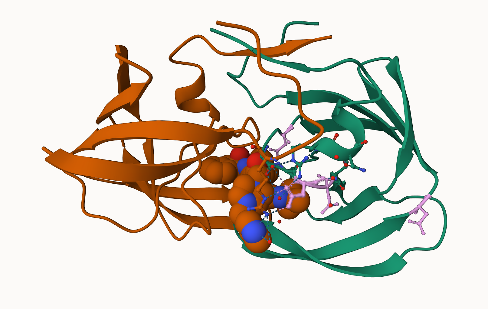

# What is in the PDB anyway? 

Tha main database of biomolecular structures is called the PDB and is available at www.rcsb.org. 

Let's begin by seeing what is in this database: 

```{r}
stats <- read.csv("Data Export Summary.csv", row.names=1)
stats_df <- as.data.frame(stats)
stats_df
```

> Q1: What percentage of structures in the PDB are solved by X-Ray and Electron Microscopy.

```{r}
# delete commas to make values numeric 
n.xray <- sum( as.numeric(gsub(",", "", stats_df[,1])))
n.em <- sum( as.numeric(gsub(",", "", stats_df[,2])))
n.total <- sum( as.numeric(gsub(",", "", stats_df[,7])))

# calculate percent to 2 sigfigs
p.stats <- function(num, tot) {
  percent <- round(((num/tot)*100), 2)
  percent
}

p.stats(n.xray, n.total)
p.stats(n.em, n.total)
```
There are `p.stats(n.xray, n.total%` xray structures and `p.stats(n.em, n.total)%` EM structures in the current PDB database. 

> Q2: What proportion of structures in the PDB are protein?

```{r}
n.prot <- sum(as.numeric(gsub(",", "", stats_df[1:3,7])))
p.prot <- p.stats(n.prot, n.total)
p.prot

ind.prot <- (as.numeric(gsub(",", "", stats_df[1:3,7])))
ind.prot/n.total
```
`ind.prot/n.total` of the structures in the PDB are protein. 


> Q3: Type HIV in the PDB website search box on the home page and determine how many HIV-1 protease structures are in the current PDB?

It is not straightforward to find all HIV-1 protease structures using plain text searching in the database. 

# Visualizing the HIV-1 protease structure

A wee pic of HIV-1 Protease from Molstar. 

 


> Q4: Water molecules normally have 3 atoms. Why do we see just one atom per water molecule in this structure?

The resolution of the structure file is 2 Angstroms. A Hydrogen atom is about 1 Angstrom in size, requiring a resolution smaller than that to view it. The atom shown is the Oxygen in the water molecule. 

> Q5: There is a critical “conserved” water molecule in the binding site. Can you identify this water molecule? What residue number does this water molecule have 

HOH 308

> Q6: Generate and save a figure clearly showing the two distinct chains of HIV-protease along with the ligand. You might also consider showing the catalytic residues ASP 25 in each chain and the critical water (we recommend “Ball & Stick” for these side-chains). Add this figure to your Quarto document.


# Introduction to Bio3D in R

```{r}
# Use Bio3D 
library(bio3d)
pdb <- read.pdb("1hsg")
pdb 
```
```{r}
head(pdb$atom)
```

What is the first residue 3 letter code? 

```{r}
pdb$atom$resid[1]
aa321(pdb$atom$resid[1])
```

> Q7: How many amino acid residues are there in this pdb object? 

198 aa residues 

> Q8: Name one of the two non-protein residues? 

HOH

> Q9: How many protein chains are in this structure? 

2

```{r}
attributes(pdb)
```

## Predicting functional motions of a single structure 

Let's read a new PDB structure of Adenylate Kinase (PDB code: 6s36) and perform Normal mode analysis. 

```{r}
adk <- read.pdb("6s36")
adk
```

Normal mode analysis (NMA) is a structural bioinformatics method to predict protein flexibility and potential functional motions (a.k.a. conformational changes).

```{r}
m <- nma(adk)
```

```{r}
plot(m)
```

```{r}
mktrj(m, file="adk_m7.pdb")
```

# Comparative structure analysis of Adenylate Kinase 

We will now be conducting a Principal Component Analysis on the complete collection of Adenylate kinase structures in the PDB. 

We begin with getting a singl eprotein sequence for a protein family of interest. 

> Q10. Which of the packages above is found only on BioConductor and not CRAN? 

msa package.

> Q11. Which of the above packages is not found on BioConductor or CRAN?: 

bio3d view

> Q12. True or False? Functions from the devtools package can be used to install packages from GitHub and BitBucket? 

True 

```{r}
library(bio3d)

aa <- get.seq("1ake_A")
aa
```

> Q13. How many amino acids are in this sequence, i.e. how long is this sequence? 

214 amino acids long

Now we can use this sequence as a query to BLAST search the PDB to find similar sequences and structures. 

```{r}
# Blast or hmmer search 
# b <- blast.pdb(aa) 
```

Rather than re-running the BLAST search every time this document loads (and save these results for this point in time), we can save and load the blast results. 

```{r}
# saveRDS(b, file="blast_results.RDS")
```

```{r}
b <- readRDS("blast_results.RDS")
```

A summary plot of our BLAST results
```{r}
hits <- plot(b)
```

```{r}
hits
```

```{r}
hits$pdb.id
```

```{r}
# Download related PDB files
files <- get.pdb(hits$pdb.id, path="pdbs", splot=TRUE, gzip=TRUE)
```

## Align and superpose structures!

We will now use the `pdbaln()` function to optionally fit (i.e. superpose) the identified PDB structures.
```{r}
#Align related PDBs
pdbs <- pdbaln(files, fit=TRUE, exefile="msa")
pdbs
```
```{r}
# Vector containing PDB codes for figure axis
ids <- basename.pdb(pdbs$id)

# Draw schematic alignment
plot(pdbs, labels=ids)
```

Collect annotation for each entry: 
```{r}
anno <- pdb.annotate(ids)
unique(anno$source)

head(anno)
```


Time for PCA. We will use no tthe `prcomp()` function from base R, but the `pca()` function from the `bio3d` package as this one is designed to work nicely with biomolecular data. 

```{r}
pc.xray <- pca(pdbs)
plot(pc.xray)
```

We can now focus in on PC1 vs PC2

```{r}
# Calculate RMSD
rd <- rmsd(pdbs)

# Structure-based clustering
hc.rd <- hclust(dist(rd))
grps.rd <- cutree(hc.rd, k=3)

plot(hc.rd)
```

```{r}
plot(pc.xray, 1:2, col="grey50", bg=grps.rd, pch=21, cex=1)
```

# Further Visualization

To visualize the major structural variations in the ensemble the function `mktrj()` can be used to generate a trajectory PDB file by interpolating along a give PC (eigenvector):

```{r}
# Visualize first principal component
mktrj(pc.xray, pc=1, file="pc_1.pdb")
```

We can now open this trajectory file in Molstar to view a wee movie of the major differences (i.e. displacements) in the structure set as we move along PC1. 

```{r}
#Plotting results with ggplot2
library(ggplot2)
library(ggrepel)

df <- data.frame(PC1=pc.xray$z[,1], 
                 PC2=pc.xray$z[,2], 
                 col=as.factor(grps.rd),
                 ids=ids)

p <- ggplot(df) + 
  aes(PC1, PC2, col=col, label=ids) +
  geom_point(size=2) +
  geom_text_repel(max.overlaps = 20) +
  theme(legend.position = "none")
p
```

# Normal Mode Analysis

Function `nma()` provides normal mode analysis (NMA) on both single structures (if given a singe PDB input object) or the complete structure ensemble (if provided with a PDBS input object). This facilitates characterizing and comparing flexibility profiles of related protein structures. 


